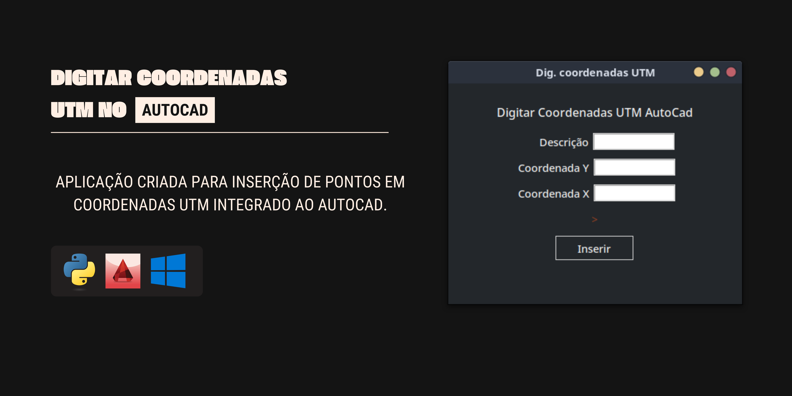

# DIGITAR PONTOS COM COORDENADAS NO AUTOCAD



Aplicação criada para inserção de pontos em coordenadas UTM integrado ao AutoCad.

Utilizando circulo e texto cria-se a representação de um ponto em um arquivo DWG, pode ser muito util quando é necessário digitar longas listas de coordenadas com identificação diretamente no autocad, podendo utilizar somente o teclado e sem ter que ficar trocando o foco, ou alternando entre teclado e mouse.

### sumário

1. [Como usar](#como-usar)
2. [Desenvolvimento](#desenvolvimento)
    - [Preparação do ambiente](#preparação-do-ambiente)
    - [Pespectiva de atualização](#pespectiva-de-atualização)
3. [Autor](#autor)
## Como usar

Requisitos:
- Windows 10/11
- AutoCad

Clique no botão para acessar a pagina do arquivo. 

[](https://github.com/paulosergiocf/Digitar_Coordenadas_utm_AutoCad/blob/develop/dist/DigitarCoordenasUtmAutoCad.zip)

Agora clique no icone de download ou pressione o atalho: ```ctrl + shift + s```

### Passo a Passo
- Descompacte o arquivo para pasta de sua preferência.
- Abra o arquivo **dwg** em que deseja inserir as coordenadas.
- Execute a aplicação.
- Digite as coordenadas conforme deseja.
- Agora no **dwg** utilize o comando zoon extend ou pressione duas vezes o scrool-look no mouse.

Pronto, todas as coordendas serão exibidas.


### E se acontecer um problema?

Se houver alguma problema durante a execução a aplicação indicará na tela.

]

A execução da aplicação também pode ser monitorada na pasta __/logs__ dentro da pasta da aplicação, esta pasta é criada automaticamente na primeira execução.


## Desenvolvimento

### informações do projeto.
[](https://www.python.org/downloads/release/python-360/) [](#pespectiva-de-atualização)


### Preparação do ambiente

Para utilizar o projeto crie um ambiente virtual.

```sh
    python -m venv .venv
```

Em seguida ative o ambiente em sua maquina.
```sh
    source .venv/bin/activate
```
Agora instale os dependencias nescessárias:

```sh
    pip install -r requeriments.txt
```


### Pespectiva de atualização.

Este projeto esta em sua ultima atualização, é um projeto antigo que já não tem mais uso para mim, apartir de 05/2024 não receberá mais atualização.

No entando, dependedo de sua área de atuação extender os recursos dele pode proporcionar muio eficacia a rotina de escritório, faça um fork e por favor me notifique sobre seu projeto, vou adorar ve-lo.

### Gerar executavel.

Para gerar o executavel usei a lib **auto-py-to-exe** que pode ser instalada com o comando ```pip install auto-py-to-exe``` para gerar novamente pode importar as configurações usando o __build.json__ dentro do diretorio config.

## Autor

Paulo Sergio de Campos Filho 

[paulosergiocf.dev@gmail.com](mailto:paulosergiocf.dev@gmail.com)

[https://github.com/paulosergiocf](https://github.com/paulosergiocf)
